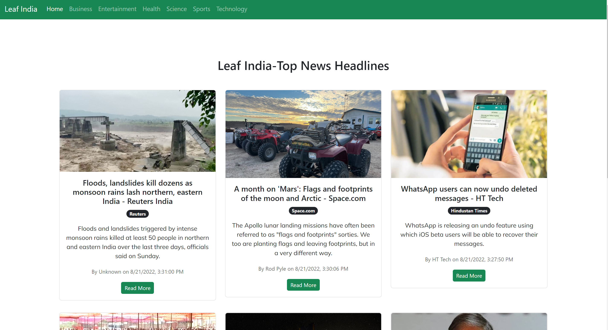

# Leaf India- news on the go




---

## Run on your Local Machine

1. Create a clone of this repository or download the repository
   ```
   git clone https://github.com/moayaan1911/leaf-india.git
   ```
2. Run

   ```
   npm i
   ```

   This will install all dependencies.

3. Run

   ```
   npm run start
   ```

   This will run it on your local machine.

**This project can't run on a deployed link as it uses a development API and is a practice project.**

## Tech Stack

The Tech Stack used in this project are:-

1. React js (https://reactjs.org/)
2. Bootstrap (https://getbootstrap.com/)
3. News API (https://newsapi.org/)
4. icons8 (https://icons8.com/)
5. Google Fonts (https://fonts.google.com/)

# Follow the Developer

Hello Everyone, My name is Mohammad Ayaan Siddiqui. I am a WEB3 developer and a FIRM BELIEVER of DECENTRALIZED WEB. If you want to connect with me, the socials are below.

Github- https://github.com/moayaan1911
Linkedin- "https://www.linkedin.com/in/mohammad-ayaan-siddiqui-678564214/
Twitter- https://www.twitter.com/usdisshitcoin
Instagram- https://www.instagram.com/moayaan_1911
Telegram:- https://t.me/usdisshitcoin

## Thank You

If you are reading this section, THANK YOU very much for ur time and support ❤️❤️
